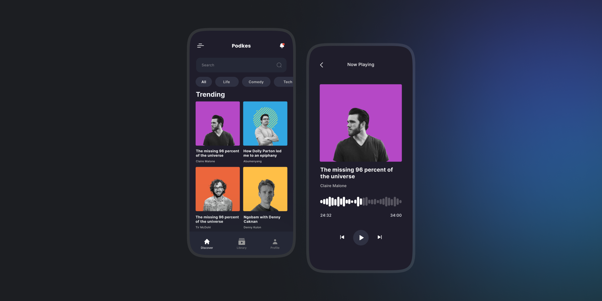

<a target="_blank" align="center">
  
</a>

<p align="center">
  <a href="#-tecnologias">Tecnologias</a>&nbsp;&nbsp;&nbsp;|&nbsp;&nbsp;&nbsp;
  <a href="#memo-licença">Licença</a>
</p>

<p align="center">
 
  
  

  
</p>


## 📝 Descrição

A aplicação Podcast Player foi desenvolvida com o intuito de testar a ferramenta de player de áudio do [Expo](https://expo.dev/), a [expo-av](https://docs.expo.dev/versions/latest/sdk/audio/).

## ⚡️ Iniciando o Projeto

### Clonando Projeto
```bash
git clone https://github.com/RennanD/podcast-player.git
```

### Requisitos

* [Node](https://nodejs.org/en/)
* [Expo Cli](https://docs.expo.dev/workflow/expo-cli/)
### Instalando Dependências  
* Utilizando NPM 
```bash
npm i
```

### Iniciando Projeto  
* Utilizando NPM 
```bash
expo start
```

### Configurando e inicindo a api

Para iniciar a api você precisa alterar o arquivo `./src/services/api.ts`, adicionando o IP da sua máquina no lugar do `localhost` no `baseURL`.

## 🚀 Tecnologias

- [React Native](https://reactnative.dev/)
- [Expo](https://expo.dev/)
- [Native Base](https://nativebase.io/)

## :memo: Licença

Esse projeto está sob a licença MIT. Veja o arquivo [LICENSE](LICENSE) para mais detalhes.

---

Feito com ♥ by rennand